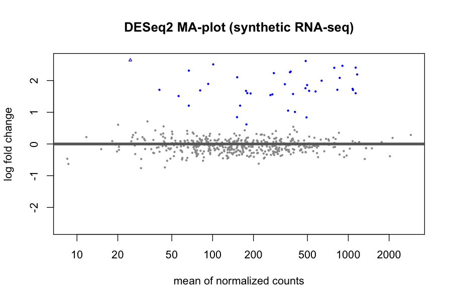
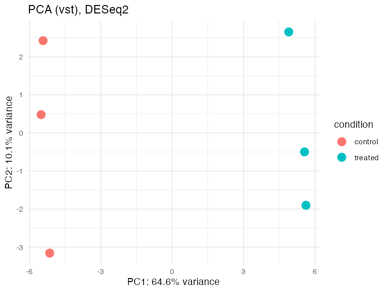
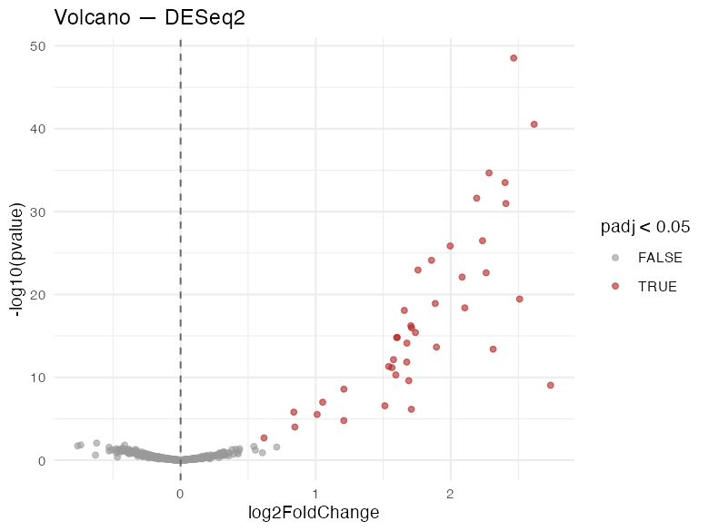

## Cheat sheet (90 seconds)

| Step | Tool (R) | Idea |
|---|---|---|
| count matrix | `DESeqDataSetFromMatrix` | genes × samples, integer counts |
| size factors | `DESeq()` (median-of-ratios) | library-depth correction |
| dispersion | `estimateDispersions` (inside `DESeq`) | gene-wise NB variance |
| NB GLM test | `results(dds)` | log2FC + Wald test |
| multiple testing | Benjamini–Hochberg `padj` | FDR ≤ 5% = expected 5% false among calls |
| QC | `plotMA`, PCA on VST | the two plots every paper shows |
| edgeR twin | `calcNormFactors(TMM) → glmQLFit → glmQLFTest` | different math, same answers |
| Python twin | PyDESeq2 (local/Colab) | same model in Python |

## The 🧊 frozen-output workflow (why some cells don't run here)

Bioconductor (DESeq2/edgeR) **does not compile to WebAssembly**, so those
cells can't run in your browser — anywhere. The course's answer: the outputs
below are **real**, generated by committed scripts you can run on your Mac:

```bash
Rscript scripts/rnaseq/make_synthetic_counts.R   # seed 2024, planted 40 DE genes
Rscript scripts/rnaseq/deseq2_analysis.R         # → output/deseq2_*.csv/png
Rscript scripts/rnaseq/edger_analysis.R          # → output/edger_results.csv
```

🧊 cells show what those runs produced. Everything else today (and the
whole project) is live.

## The data (also live, for QC plots)

500 genes × 6 samples (3 control, 3 treated), **40 genes planted as truly
DE** — so unlike real data, we know the ground truth and can score the tools.

```{webr}
#| label: load-rnaseq
counts <- read.csv("data/rnaseq/counts.csv", row.names = 1, check.names = FALSE)
coldata <- read.csv("data/rnaseq/coldata.csv")
dim(counts); coldata
```

## The DESeq2 pipeline, 🧊 frozen

This is `scripts/rnaseq/deseq2_analysis.R`, verbatim:

```r
# 🧊 FROZEN — run locally with Rscript scripts/rnaseq/deseq2_analysis.R
library(DESeq2)

dds <- DESeqDataSetFromMatrix(countData = counts,
                              colData   = coldata,
                              design    = ~ condition)
dds  <- DESeq(dds)                     # size factors, dispersions, NB GLM
res  <- as.data.frame(results(dds))
sig  <- subset(res, padj < 0.05)
```

**Actual output from the committed run:**

- **40 genes with padj < 0.05** — 40 up, 0 down
- **39 / 40 planted genes recovered** (one slipped past FDR 0.05 — with 6
  samples, power is finite; this is normal, not a bug)

Top 6 by adjusted p-value:

| gene | baseMean | log2FoldChange | padj |
|---|---|---|---|
| GENE012 | 905 | 2.47 | 1.49e-46 |
| GENE030 | 485 | 2.62 | 7.38e-39 |
| GENE008 | 376 | 2.28 | 3.63e-33 |
| GENE018 | 788 | 2.40 | 3.90e-32 |
| GENE021 | 1163 | 2.19 | 2.42e-30 |
| GENE001 | 1134 | 2.41 | 8.82e-30 |







Read the QC like a reviewer: **MA** — the cloud sits near log2FC 0 with DE
calls (red) offset; no fanning with mean = no strong mean-dependent bias.
**PCA** — PC1 separates control from treated cleanly; if samples clustered
by *batch* instead, the design formula (`~ batch + condition`) would be the
fix. **Volcano** — the significance wall on the right at moderate |LFC|.

## edgeR: same data, second dialect

```r
# 🧊 FROZEN — Rscript scripts/rnaseq/edger_analysis.R
y     <- calcNormFactors(DGEList(counts, group = condition), method = "TMM")
fit   <- glmQLFit(estimateDisp(y, design), design)
qlf   <- glmQLFTest(fit, coef = "conditiontreated")
```

**Actual output:** 41 genes at FDR < 0.05, **40/40 planted genes
recovered**; top calls nearly identical to DESeq2's (GENE030, GENE012,
GENE001 …), and the log2FC correlation between tools across all 500 genes:

> **r = 1.00**

Two tools, different normalization (median-of-ratios vs TMM), different
test (Wald vs quasi-likelihood F-test) — same biology. When they *don't*
agree on real data, that disagreement is diagnostic (batch structures,
extreme counts, low power), and you look at the QC plots before trusting
either.

## PyDESeq2: the Python twin

`scripts/rnaseq/pydeseq2_analysis.py` re-runs the same model in Python.
It needs `pip install pydeseq2` and a local interpreter (no browser/Colab
required):

```python
# from scripts/rnaseq/pydeseq2_analysis.py
dds = DeseqDataSet(counts=counts.T, metadata=coldata.set_index("sample_id"),
                   design_factors="condition", seed=2024)
dds.deseq2()
stats = DeseqStats(dds, contrast=("condition", "treated", "control"))
stats.summary()
```

Note the transposed counts (samples as **rows** — sklearn/PyDESeq2
convention; R wants genes × samples).

## Live QC: dispersion & mean-variance, ggplot

The frozen plots need DESeq2, but their *inputs* are just counts. Mean–variance
trend live in your browser:

```{webr}
#| label: live-qc
library(dplyr, warn.conflicts = FALSE)
library(ggplot2)

counts |>
  mutate(mean = apply(counts, 1, mean), var = apply(counts, 1, var)) |>
  ggplot(aes(mean + 1, var + 1)) +
  geom_point(alpha = 0.5, size = 1) +
  geom_abline(slope = 1, linetype = "dashed", color = "firebrick") +
  scale_x_log10() + scale_y_log10() +
  labs(x = "mean count + 1", y = "variance + 1",
       title = "Counts over-disperse (variance > mean): NB, not Poisson") +
  theme_minimal()
```

Points above the dashed line (variance > mean) are why RNA-seq uses the
**negative binomial** (adds a dispersion parameter) instead of Poisson —
the GLM you just saw frozen.

## 🧪 Project 4 — the classifier meets the expression matrix

`data/p4/`: 200 genes × 60 samples, normal vs tumor, **25 genes planted
tumor-up**. Your study: can a model find the tumor — and can you trust it?

```{pyodide}
#| label: p4-setup
import numpy as np
import pandas as pd
from sklearn.model_selection import train_test_split, cross_val_score, StratifiedKFold
from sklearn.pipeline import Pipeline
from sklearn.preprocessing import StandardScaler
from sklearn.linear_model import LogisticRegression
from sklearn.ensemble import RandomForestClassifier

expr = pd.read_csv("data/p4/expr.csv", index_col=0)
labels = pd.read_csv("data/p4/labels.csv")
X, y = expr.T, labels.set_index("sample_id").loc[expr.T.index, "condition"]

X_tr, X_te, y_tr, y_te = train_test_split(
    X, y, test_size=0.25, stratify=y, random_state=42)

candidates = {
    "logistic": Pipeline([("scale", StandardScaler()),
                          ("m", LogisticRegression(max_iter=5000, random_state=42))]),
    "forest":   Pipeline([("m", RandomForestClassifier(n_estimators=500,
                                                       random_state=42))]),
}
for name, m in candidates.items():
    cv = cross_val_score(m, X_tr, y_tr, cv=StratifiedKFold(5, shuffle=True,
                                                           random_state=42))
    m.fit(X_tr, y_tr)
    print(f"{name:8s} CV {cv.mean():.3f}±{cv.std():.3f}   test {m.score(X_te, y_te):.3f}")
```

**Your study questions** (the exercises below):

1. Do both model families beat the 50% coin flip — by how much, with what
   variance across folds?
2. Which genes drive the forest's calls? Do they land in the planted
   signature (`SIG001–SIG010`)?
3. What's the DE-connection: a gene's *p*-value is not its *importance* —
   show one gene where the two disagree, and argue why that's fine.

## Exercises

### Exercise 1 — the 50-samples problem

Repeat the forest CV with 20, 40, 60 training samples (subsample with a
seed). Plot or tabulate CV accuracy vs n. At what n does it stabilize?

```{pyodide}
#| exercise: ex-w4d5-n
from sklearn.model_selection import cross_val_score
from sklearn.ensemble import RandomForestClassifier

rng = np.random.default_rng(42)

for n in (20, 40, 60):
    idx = rng.choice(len(X_tr), size=min(n, len(X_tr)), replace=False)
    m = RandomForestClassifier(n_estimators=300, random_state=42)
    ______
```

::: {.hint exercise="ex-w4d5-n"}
`cross_val_score(m, X_tr.iloc[idx], y_tr.iloc[idx], cv=5).mean()` — with a
seeded `rng = np.random.default_rng(42)` for the subsample.
:::

::: {.solution exercise="ex-w4d5-n"}
```python
rng = np.random.default_rng(42)
for n in (20, 40, 60):
    idx = rng.choice(len(X_tr), size=min(n, len(X_tr)), replace=False)
    m = RandomForestClassifier(n_estimators=300, random_state=42)
    cv = cross_val_score(m, X_tr.iloc[idx], y_tr.iloc[idx], cv=5)
    print(f"n={n}: {cv.mean():.3f}±{cv.std():.3f}")
# Accuracy climbs and its error bars shrink; by n=60 it's near ceiling on
# this easy synthetic problem. Real data: expect a slower, noisier climb.
```
:::

### Exercise 2 — importance vs p-value (the biology lesson)

The forest's top-12 important genes: how many are in the planted signature
(`SIG001`..`SIG025`)? Name one background gene that made the list and argue
(in a comment) why importance ≠ differential expression.

```{pyodide}
#| exercise: ex-w4d5-importance
imp = pd.Series(candidates["forest"].named_steps["m"].feature_importances_,
                index=X.columns).sort_values(ascending=False)
top12 = list(imp.head(12).index)
______
```

::: {.hint exercise="ex-w4d5-importance"}
Signature membership: `g[3:].isdigit() and 1 <= int(g[3:]) <= 10`.
Importance measures *prediction contribution* (correlated genes share it);
p-values measure *per-gene evidence of difference*.
:::

::: {.solution exercise="ex-w4d5-importance"}
```python
def in_signature(g):
    return g.startswith("SIG") and g[3:].isdigit() and 1 <= int(g[3:]) <= 10

print(f"{sum(map(in_signature, top12))} / 12 top genes are planted signature")
print("background genes in top 12:", [g for g in top12 if not in_signature(g)])
# A noisy background gene can rank high by chance (200 candidates, 12 slots)
# or by correlation with true signal — importance is a model statistic,
# not a biology claim. DE testing (frozen above) is the tool for that.
```
:::

### Exercise 3 — your own frozen-output run

On your Mac: run the three RNA-seq scripts (commands at the top of this
lesson). Then answer, from YOUR outputs: how many genes at padj < 0.05, and
does your number match the frozen 40 exactly? Why must it?

```{webr}
#| exercise: ex-w4d5-repro
# Answer as comments:
# my count: ______
# matches frozen (yes/no): ______
# why: ______
```

::: {.hint exercise="ex-w4d5-repro"}
Seed 2024 in the generator + DESeq2 is deterministic (no stochastic step) →
byte-identical results on the same R/Bioc versions.
:::

::: {.solution exercise="ex-w4d5-repro"}
```r
# my count: 40
# matches frozen: yes
# why: the generator is seeded (set.seed(2024)) and DESeq2's pipeline is
# fully deterministic; with the same package versions, everyone gets the
# same numbers. If your count differs, check package versions first
# (sessionInfo) — the W3D3 hand-off checklist exists for exactly this.
```
:::

### Exercise 4 — the report

Assemble today into a 1-page Quarto document (W2D5 style, reproducibility
checklist enforced): the three frozen plots, your classifier's CV + test
numbers, the importance table, and a 5-sentence conclusion. Seed everything;
end with `sessionInfo()`.

## Common pitfalls (real ones)

::: {.callout-warning}
## 1. Non-integer counts into DESeq2
DESeq2 demands raw integer counts — normalized/FPKM/TPM values error or,
silently worse, produce meaningless dispersions. Raw counts in; size
factors handle depth.
:::

::: {.callout-warning}
## 2. Forgetting the design formula
`~ condition` is the *minimum*. With paired samples or batches it's
`~ patient + condition` — omit the nuisance term and every DE call is
suspect. The design formula IS the scientific question.
:::

::: {.callout-warning}
## 3. Treating padj like evidence strength
padj < 0.05 is a *decision threshold*, not a ranking. Rank by LFC (or
svalue); report padj as the screen. And 39/40 recovered at n=3/group is
fine — power, not failure.
:::

## Self-quiz — predict the output

```{webr}
#| label: quiz
# Q1: DESeq2 size factors correct for what artifact of library prep?
# Q2: why negative binomial rather than Poisson for counts?
# Q3: padj < 0.05 with 500 genes tested: at most how many false calls expected?
# Q4: in the MA-plot, a systematic banana-shaped trend would mean what?
# Q5: your DESeq2 and edgeR LFCs correlate at r = 0.72 — next step?
```

::: {.callout-tip collapse="true"}
## Quiz answers
1. Sequencing depth (library size) — median-of-ratios also tames a few very
   highly-expressed genes dominating the factor
2. Counts are over-dispersed (variance > mean, see the live QC plot);
   Poisson forces variance = mean
3. ~25 (5% of however many *calls* you make — BH bounds the false discovery
   rate among rejected hypotheses)
4. Mean-dependent bias — normalization isn't holding; check library
   composition, consider TMM or `sizeFactors` diagnostics
5. Trust neither yet: compare QC plots, check for a batch/design mismatch,
   and look at which genes disagree (low counts? outliers?) — r = 1.00 on
   today's data is the calibrated baseline
:::

## Wrap-up checklist

- [ ] Counts → size factors → NB GLM → BH: I can narrate the pipeline
- [ ] MA + PCA read as diagnostics, not decoration
- [ ] Two tools agreeing (r = 1.00) calibrates trust; disagreement triggers QC
- [ ] Classifier found the tumor; importance ≠ p-value, and I can say why
- [ ] Project 4 report passes the W3D3 hand-off checklist
- [ ] I scored 5/5 on the self-quiz

**Next week (Week 5):** single-cell, trajectories, and HMMs at full scale —
the capstone.
